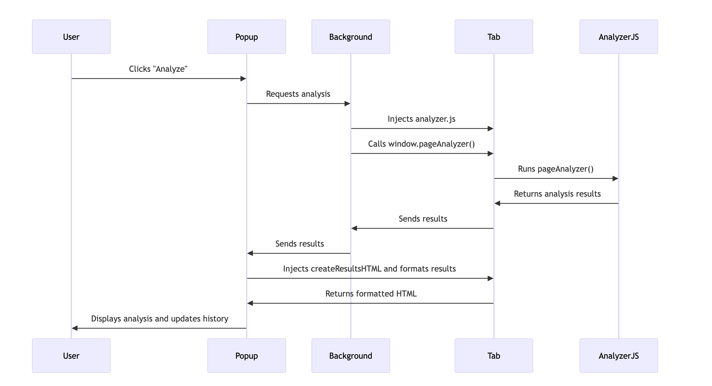

# CSR vs SSR Detector

[](https://chromewebstore.google.com/detail/csr-vs-ssr-detector/fhiopdjeekafnhmfbcfoolhejdgjpkgg)
[](https://opensource.org/licenses/MIT)
[](https://github.com/dzienisz/chrome-ssr-csr/releases)

The **CSR vs SSR Detector** is a Chrome extension that helps developers and SEO specialists identify whether a webpage is rendered using Client-Side Rendering (CSR), Server-Side Rendering (SSR), or a hybrid approach. Understanding this distinction is essential for making informed decisions about SEO, page performance, and overall application architecture.

## ✨ Features

- **🎯 Accurate Detection**: Advanced algorithm analyzes 15+ indicators including DOM structure, framework markers, performance metrics, and meta tags
- **🚀 Framework Recognition**: Automatically detects popular frameworks:
  - SSR: Next.js, Nuxt, Gatsby, Remix, SvelteKit, Astro, Qwik, SolidJS
  - Static: Jekyll, Hugo, Eleventy, Hexo
  - SPA: React, Vue, Angular, Svelte
- **📊 Detailed Analysis**:
  - Confidence score (30-95%)
  - Rendering type classification (5 categories)
  - Performance metrics (DOM ready time, First Contentful Paint)
  - Key detection indicators
- **🌙 Dark Mode**: Beautiful dark theme with smooth transitions
- **📤 Export Results**: Download analysis as JSON, CSV, or Markdown
- **⚙️ Customizable Settings**:
  - Configurable history limit (5 to unlimited)
  - Desktop notifications toggle
  - Export/import your settings
- **📜 Smart History**: Stores analyses with customizable limits
- **🔒 Privacy-First**: All analysis happens locally, optional anonymous data sharing
- **📈 Analytics Dashboard**: View aggregated usage data (opt-in telemetry)
- **⚡ Instant Results**: One-click analysis with clear visual feedback

## 🎨 What's the Difference?

**Server-Side Rendering (SSR)**
- Content is generated on the server before being sent to the browser
- Better for SEO and initial load performance
- Faster First Contentful Paint (FCP)
- Examples: Next.js apps, Nuxt sites, traditional server-rendered pages

**Client-Side Rendering (CSR)**
- Content is generated in the browser using JavaScript
- Better for rich interactions and app-like experiences
- May have slower initial load but smoother navigation
- Examples: React SPAs, Vue apps without SSR

**Hybrid Rendering**
- Combines both approaches for optimal performance
- Initial page load is server-rendered, subsequent navigation is client-side
- Best of both worlds for complex applications

## 🔍 How It Works

The extension uses a sophisticated weighted scoring system that analyzes:

1. **HTML Content Structure**: Rich initial content, semantic elements, text length
2. **Framework Markers**: Hydration attributes, framework-specific DOM elements
3. **Serialized Data**: Inline JSON data patterns (`__NEXT_DATA__`, `__INITIAL_STATE__`, etc.)
4. **Meta Tags**: SEO meta tags, Open Graph, framework identifiers
5. **Script Patterns**: Lazy loading, code splitting, hydration scripts
6. **Performance Metrics**: DOM ready time, First Contentful Paint
7. **Client-Side Routing**: SPA router elements and patterns
8. **Structured Data**: JSON-LD presence
9. **Content-to-Script Ratio**: Balance between content and JavaScript

Each indicator contributes to an SSR or CSR score, which determines the final classification with a confidence percentage.

## Sequence Diagram



## 📥 Installation

### From Chrome Web Store (Recommended)
1. Visit the [Chrome Web Store](https://chromewebstore.google.com/detail/csr-vs-ssr-detector/fhiopdjeekafnhmfbcfoolhejdgjpkgg)
2. Click "Add to Chrome"
3. The extension icon will appear in your toolbar

### For Development
1. Clone this repository:
   ```bash
   git clone https://github.com/dzienisz/chrome-ssr-csr.git
   cd chrome-ssr-csr
   ```
2. Open Chrome and navigate to `chrome://extensions`
3. Enable **Developer Mode** (toggle in top-right)
4. Click **Load unpacked** and select the project directory
5. The extension is now loaded and ready to use

## 🚀 Usage

1. Navigate to any website you want to analyze
2. Click the CSR vs SSR Detector icon in your Chrome toolbar
3. Click the "Analyze Page" button
4. View detailed results including:
   - Rendering type classification
   - Confidence score with visual indicator
   - Detected frameworks
   - Performance metrics
   - Key detection indicators
5. Check your analysis history by clicking "View History"

## 📊 Classification Types

The extension categorizes pages into 5 rendering types:

- **Server-Side Rendered (SSR)** - 75%+ SSR score
- **Client-Side Rendered (CSR)** - 25% or less SSR score
- **Likely SSR with Hydration** - 60-74% SSR score
- **Likely CSR/SPA** - 26-40% SSR score
- **Hybrid/Mixed Rendering** - 41-59% SSR score

## 🤝 Contributing

Contributions are welcome! I'm seeking help to improve the **CSR vs SSR Detector** further. Potential areas for enhancement:

- Improving detection accuracy for edge cases and new frameworks
- Adding support for emerging rendering techniques (Partial Hydration, Islands Architecture, etc.)
- Performance optimizations
- Additional framework support
- Improved UI/UX
- Better error handling

### Development Setup

1. Fork and clone this repository
2. Load the extension in Chrome (see Installation > For Development)
3. Make your changes
4. Test thoroughly on various websites
5. Submit a pull request with a clear description

### Testing

Test the extension on various types of websites:
- Next.js sites (e.g., nextjs.org, vercel.com)
- Static sites (e.g., gatsby sites, hugo sites)
- React SPAs (e.g., create-react-app applications)
- Traditional server-rendered pages
- Hybrid applications

### Code Style

- Use clear, descriptive variable names
- Add comments for complex logic
- Follow existing code structure
- No external dependencies (keep it vanilla JS)

## 📝 Documentation

- [CHANGELOG.md](CHANGELOG.md) - Version history and release notes
- [ROADMAP.md](ROADMAP.md) - Future features and development plans
- [CLAUDE.md](CLAUDE.md) - AI assistant development guide
- [privacy-policy.md](privacy-policy.md) - Privacy policy

## 🐛 Bug Reports & Feature Requests

Found a bug or have a feature request? Please open an issue on [GitHub Issues](https://github.com/dzienisz/chrome-ssr-csr/issues) with:

**For bugs:**
- Extension version
- Chrome version
- Website URL where the issue occurred
- Expected vs actual behavior
- Screenshots if applicable

**For features:**
- Clear description of the proposed feature
- Use case / rationale
- Any implementation ideas

## 📜 License

This project is licensed under the MIT License - see the [LICENSE](LICENSE) file for details.

## 🙏 Acknowledgments

- Built with vanilla JavaScript and Chrome Extension APIs
- Uses Chrome Manifest V3 for better security and performance
- Community contributions and feedback

## 📬 Contact

- GitHub: [@dzienisz](https://github.com/dzienisz)
- Issues: [GitHub Issues](https://github.com/dzienisz/chrome-ssr-csr/issues)
- Chrome Web Store: [CSR vs SSR Detector](https://chromewebstore.google.com/detail/csr-vs-ssr-detector/fhiopdjeekafnhmfbcfoolhejdgjpkgg)

---

Made with ❤️ for developers who care about rendering strategies
